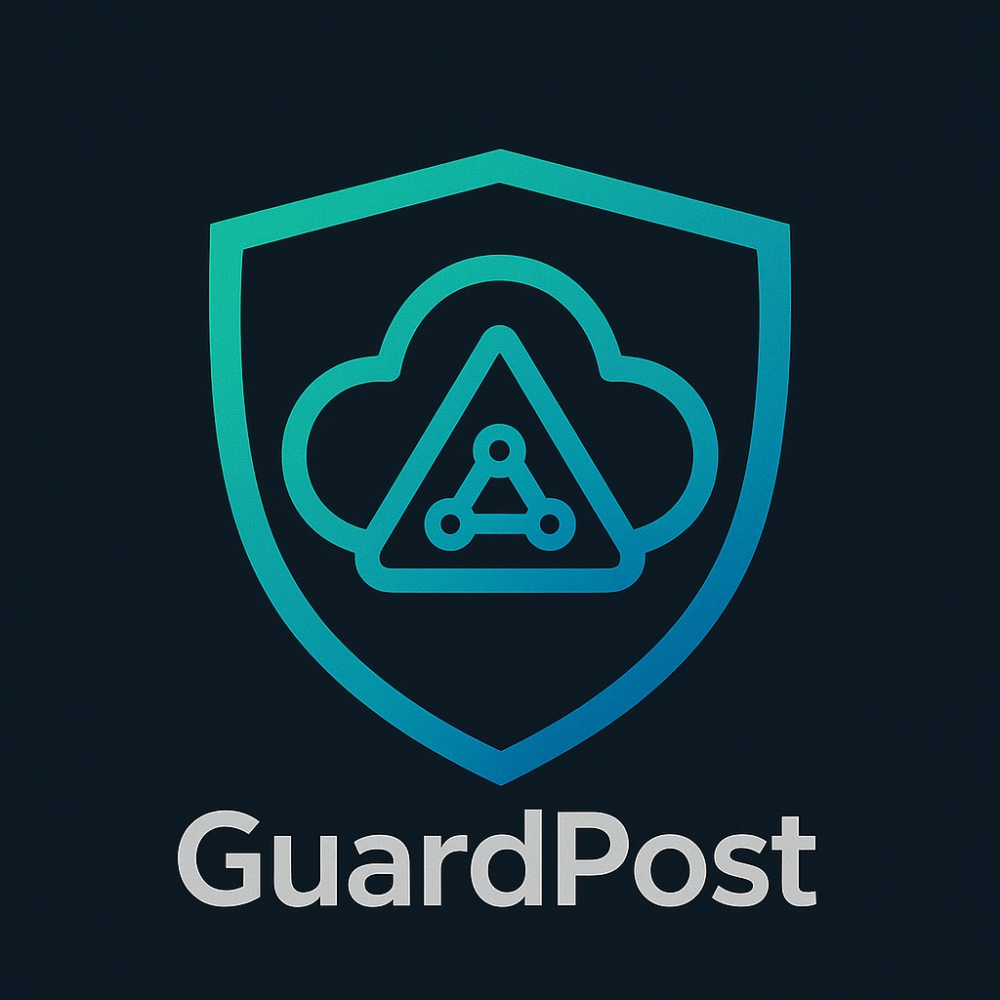

<p align="center">
    <picture>
        
    </picture>
</p>

# GuardPost Core
### *Defend your cloud infrastructure with unprecedented visibility and control*

[](https://github.com/trinity-cloud/guardpost-core/blob/master/LICENSE)

GuardPost Core is the foundation of the GuardPost Cloud Security Platform - an innovative solution that transforms how organizations secure their AWS environments. By combining comprehensive scanning, advanced graph-based analysis, and actionable AI-driven remediation guidance, GuardPost empowers security teams to identify, prioritize, and eliminate cloud security risks before they become breaches.

## Why GuardPost?

In today's complex cloud environments, traditional security tools fail to detect the intricate connections between resources that attackers exploit. GuardPost solves this critical blindspot with a unique approach:

* **Complete Visibility** - Gain unprecedented insight into your entire AWS security posture with deep multi-service scanning
* **Relationship Intelligence** - Uncover hidden attack paths by understanding how resources connect and interact across your infrastructure
* **Context-Rich Remediation** - Transform findings into precise, implementable fixes with detailed guidance and IaC snippets
* **Enterprise Scalability** - Maintain robust protection as your cloud footprint grows with our high-performance architecture

## Powerful Security Capabilities

GuardPost Core delivers enterprise-grade security through:

*   **Comprehensive Multi-Service Coverage:** Deep inspection of critical AWS services including IAM, EC2, VPC, S3, RDS, and Lambda - with continuous expansion planned to cover all AWS services.

*   **Revolutionary Graph Security Engine:** Our Neo4j-powered relationship model reveals security insights traditional tools can't see, enabling sophisticated attack path analysis and privilege escalation detection.

*   **Intelligent Security Analysis:** Identifies critical misconfigurations using advanced graph-based checks and service-specific analyzers that understand AWS security best practices.

*   **Best-in-Class Remediation Guidance:**
    *   Structured, detailed explanations for every finding
    *   Clear step-by-step remediation instructions
    *   Ready-to-deploy **Infrastructure as Code (IaC) snippets** for Terraform, Pulumi, and others.
    *   **LLM-Enhanced Explanations:** Leverages Anthropic Claude to provide richer, more contextual explanations tailored to your specific environment

*   **Enterprise-Ready Architecture:** 
    *   Production-grade PostgreSQL for reliable scan history and findings storage
    *   Comprehensive REST API with robust JWT authentication
    *   Highly scalable processing with Celery for handling large AWS environments

**The Graph Advantage:** While competitors rely on simplistic JSON property checks, GuardPost's graph-native approach models critical security relationships (like Security Group Rules, S3 ACL Grants, and IAM permissions) as first-class resources. This enables sophisticated attack surface analysis that is impossible to perform with conventional tools.

## Solution Architecture: Open Core + AI Agent

GuardPost follows a powerful open-core model:

*   **GuardPost Core (This Repository):** The essential security engine with comprehensive scanning, graph analysis, and API capabilities. Licensed under the **Business Source License 1.1 (BSL 1.1)**.
    *   **Focus on Foundational Checks:** Core analyzers concentrate on identifying common, significant misconfigurations or security weaknesses.
    *   **Leverages advanced graph structures** and parsed properties for deeper security analysis.

*   **GuardPost AI Agent (Premium Add-on):** Elevate your security operations with our advanced conversational AI that delivers:
    * **Natural Language Security Interface:** Ask questions about your security posture in plain English
    * **Attack Path Visualization:** See how attackers could chain vulnerabilities to reach critical assets
    * **Automated Remediation Generation:** Get precise, customized fix recommendations for your environment
    * **Continuous Security Monitoring:** Proactive alerts when new risks emerge in your infrastructure
    * **Advanced Graph Intelligence:** Unlock powerful multi-hop analyses:
        * Comprehensive Attack Path Discovery (Internet → EC2 → Role → S3 → ... → DB)
        * Privilege Escalation Path Analysis
        * Complex Effective Permissions Calculation (considering SCPs, boundaries, etc.)
        * Toxic Permission Combination Detection (beyond basic *:*)
        * Data Exfiltration Path Detection
        * Vulnerability Correlation with Business Impact
    * **MCP Server**: Also offered as an MCP Server, to be integrated to your main agentic workflows

## Licensing

GuardPost Core is licensed under the **Business Source License 1.1**. See the [LICENSE](LICENSE) file for details.

**Key Terms:**
*   You **MAY** use, modify, and redistribute the code under the BSL terms.
*   You **MAY** use the software in production internally within your organization.
*   You **MAY NOT** offer the Licensed Work (or derivatives) as a hosted, managed, or embedded service to third parties without obtaining a separate commercial license.
*   The code automatically converts to the **Apache License, Version 2.0** four years after the publication date of each specific version.

GuardPost Core is also offered in a commercial licence, for use cases beyond BSL 1.1. For commercial licensing inquiries or to learn more about the GuardPost AI Agent, please contact hello@guardpost.ai

## Quick Start (Docker Compose)

Get GuardPost up and running in minutes:

1.  **Prerequisites:**
    *   Docker and Docker Compose installed
    *   Clone the repository:
        ```bash
        git clone <repository_url> # Update with actual URL
        cd guardpost-core
        ```

2.  **Configuration:**
    *   Copy `.env.example` to `.env`.
    *   **Review and update `.env`**: Pay close attention to `POSTGRES_PASSWORD`, `NEO4J_PASSWORD`, and `SECRET_KEY`. Generate a strong unique `SECRET_KEY`.
    *   Ensure the ports mapped in `docker-compose.yml` (e.g., 8000 for API, 7474/7687 for Neo4j) are available on your host.

3.  **Launch GuardPost:**
    ```bash
    docker compose up --build -d 
    ```

*(Note: For detailed instructions on manual setup without Docker, primarily intended for development, please refer to the documentation in the `docs/` directory).* 

## Using GuardPost

*   Access the API at `http://localhost:8000`
*   Explore the complete API documentation at `http://localhost:8000/api/v1/docs` (assuming you are using the default API_V1_STR in the .env file)
*   Visualize your security graph at `http://localhost:7474` (Neo4j Browser - default credentials `neo4j/your_neo4j_password` or as set in `.env`)
*   Monitor operations with `docker compose logs -f app` or `docker compose logs -f worker`

For more detailed information on architecture, workflows, and specific features, please see our **[Documentation](./docs/INDEX.md)**.

## API Client Integration

A Python client example (`client.py`) demonstrates GuardPost API usage:

1.  Start GuardPost services with `docker compose up`
2.  Configure AWS account settings in `client.py`
3.  Set up AWS credentials in your environment. If modifying the `.env` file, ensure you re-run `docker compose up --build -d`
4.  Configure python environment. Example (run at root of the repository):
```
python3.10 -m venv venv
source venv/bin/activate
pip install uv
uv pip install -r requirements.txt
```

4.  Run the example to see GuardPost in action:
    ```bash
    python client.py
    ```

## Graph-Based Security Analysis

GuardPost Core features a sophisticated Neo4j-based graph database that delivers powerful security analysis capabilities:

### Resource Modeling & Relationships
*   **Key AWS Services Modeled:** IAM (Users, Roles, Policies, Groups), EC2 (Instances, Security Groups), VPCs, Subnets, S3 Buckets (including ACLs and Policy Statements), RDS Instances, and Lambda Functions (including Resource Policies and Environment Variables).
*   **Policy Decomposition:** IAM policies, S3 bucket policies, and Lambda resource policies are decomposed into analyzable statement nodes.
*   **Security-Focused Relationships:** Critical relationships like `CAN_ASSUME`, `HAS_POLICY`, `APPLIES_TO`, `ALLOWS`, `ROUTES_TO`, etc., are modeled to understand interconnected risks.

### Context-Aware Findings & Remediation
*   Built-in analyzers leverage the graph to identify misconfigurations.
*   Remediation guidance is designed to be context-rich, with LLM-enhancement providing deeper insights where available.

*(For a detailed breakdown of AWS properties extracted and the graph data model, see [docs/aws_resource_properties.md](./docs/aws_resource_properties.md))*

## Join the GuardPost Community

* **Stay Connected:** Join our Discord [Trinity Cloud](https://discord.gg/qBDqceSK)
* **Contribute:** See [docs/contributing.md](./docs/contributing.md) for guidelines on helping improve GuardPost Core
* **Get Support:** Open issues on our GitHub repository for questions or feature requests


---

**Transform your cloud security posture today with GuardPost.**  
*For commercial support or to learn more about GuardPost AI Agent, contact hello@guardpost.ai*

